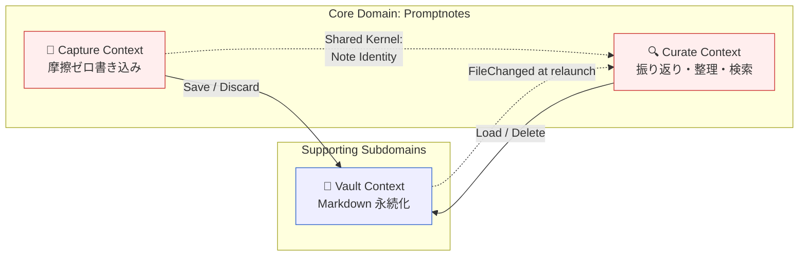

# Bounded Contexts

## Context Map 概要図



## Context 数の決定根拠

Phase 2 では **Capture / Curate / Vault** の 3 候補が出ました。Phase 3 で以下を検討：

### 検討 1：Capture と Curate を統合すべきか？

**統合派の論拠**：UI が単一画面（フィード）で同居しており、ユーザーは両者を意識せず行き来する。

**分離派の論拠**：
- ユビキタス言語が異なる（後述）
- 関心事の中心が異なる：Capture は「**編集セッション**」、Curate は「**集合への問い合わせ・メタデータ操作**」
- 心理状態が異なる：Capture は「考えを吐き出す／推敲する瞬間」、Curate は「思い出して使う／整理する瞬間」
- 自動保存・空ノート破棄など、Capture 固有のルールが多い

**判断：分離する**。同一画面という事実は UI 層の関心事であり、ドメインの境界はあくまで「言語と関心事」で決める。両者を行き来する UX を実現するため、`Note` の同一性は Shared Kernel として共有する。

#### 境界の引き方（重要）

「**編集行為そのもの（フォーカスして入力 → 自動保存）は、対象が新規か過去かに関わらず Capture の責務**」と定義する。**CodeMirror 6 単一 Markdown エディタ**（discovery.md 参照）採用後は「Editor Focus」を**「特定ノートの CodeMirror エディタにキャレットがある状態」** として再定義する。

| 操作 | Context | 理由 |
|------|---------|------|
| アプリ起動時の新規ノートの編集 | Capture | 編集セッション（先頭ノートに自動フォーカス） |
| 過去ノートをクリックして編集を始める | **Curate（瞬間） → Capture（その後）** | クリック＝Note Selection ＋ エディタフォーカス取得。フォーカス取得後はそのまま Capture のセッション |
| 開いた過去ノート内で本文を入力 | **Capture** | 編集セッションが過去ノートに対して開始されている |
| エディタ内で frontmatter を直接編集（YAML ブロック） | **Capture** | 編集セッション内 |
| フィード上のタグチップで `+` してタグ追加 | **Curate** | 編集セッション外のメタデータ操作 |
| フィード上で削除ボタンを押す | **Curate** | 集合操作 |
| 未フォーカスでフィードをスクロール | **Curate** | 閲覧・選択操作 |

要点: **Capture = エディタにフォーカスがある間の編集セッションのライフサイクル管理**、**Curate = エディタフォーカス外で起きる集合・メタデータ操作**。

> フィード上の任意ノートが常に in-place で編集可能になるため、「Note Selection（編集対象切替）」は **クリックで対象ノートのエディタにフォーカスが入る瞬間の操作** に縮退する。専用の「編集モード切替」ボタンや別画面遷移は存在しない。

### 検討 2：TagInventory は独立 Context か Curate 内 Read Model か？

**独立派の論拠**：起動時に明示的に「構築する」責務がある。Note 集合からの派生だが操作対象として独立。

**内包派の論拠**：TagInventory はフィルタ UI のためだけに存在する Read Model。独立 Context にするとオーバーヘッド。

**判断：Curate Context 内の Read Model として扱う**。
独立 Aggregate ではなく、Note 群から導出される投影（projection）。Phase 5（aggregates）で構造を確定。

### 検討 3：Vault は Supporting か Generic か？

**Supporting** と判定。
- Generic（OS のファイル I/O）は Vault Context が利用するインフラ。
- Vault Context そのものは「**Obsidian 互換の Markdown vault**」というドメイン固有の制約（YAML frontmatter 配置・タイムスタンプ命名規約・OS ゴミ箱送り）を持つため、汎用ではない。

## Bounded Context 一覧

### 1. Capture Context（Core）

- **責務**: **編集セッション**のライフサイクル全般を司る。新規ノート自動生成、本文入力、frontmatter 直接編集、自動保存（idle/blur）、コピー、空ノート破棄。**対象が新規ノートか過去ノートかは問わず、エディタにキャレットが入っている間は Capture の責務**。
- **主要 Aggregate**: `Note`（編集中の状態）
- **ユビキタス言語**:
  - **Editing Session** — Note にフォーカスが入ってから、そのフォーカスが外れる（or 別ノートに切り替わる）までの 1 ノート分の編集ライフサイクル。新規・過去どちらの Note にも適用される
  - **Note** — 編集対象のプロンプトノート（新規 draft / past note いずれも）。`body: string` を保持
  - **Body** — Note の本文（Markdown 文字列）
  - **Editor Focus** — 特定ノートのエディタに DOM 上のキャレットがある状態
  - **WYSIWYG Rendering** — Markdown シンタックスハイライトを備えたエディタ描画方式
  - **Inline Editor Library** — ノートに埋め込む CodeMirror 6 エディタ
  - **Idle Save** — 入力停止が一定時間続いたときの自動保存（Note 単位）
  - **Blur Save** — エディタからフォーカスが外れた契機の自動保存（Note 単位）
  - **Copy** — frontmatter を含めず本文のみクリップボードへ
  - **Empty Note** — `body` が空文字列または空白のみの新規ノート（破棄対象。過去ノートには適用されない）
  - **New Note Shortcut** — `Ctrl+N` または「+ 新規」ボタン
  - **Inline Frontmatter Editing** — エディタ内の YAML 領域を直接編集する操作
- **所有チーム**: TBD（MVP では単一開発者）
- **境界となる関心事**: 「**エディタにキャレットが入っている間**」のすべて。フォーカスが外れた／別ノートに切り替わった瞬間に、編集セッションは終了し、関心は Curate に渡る。

### 2. Curate Context（Core）

- **責務**: フィード表示・フィルタ・検索・ソート・**ノート選択（クリックでエディタにフォーカスを渡す瞬間の操作）**・**フィード上のメタデータ操作（タグチップ追加/削除等）**・削除。「**振り返り・整理・再利用**」の足場を提供する。**エディタにフォーカスが入った後の操作は含まない**（それは Capture）。フィード上のノートは読み取り専用プレビューではなく、各ノートがそのまま編集可能な要素として描画される（編集ロジックは Capture）。
- **主要 Aggregate**: `Feed`（一覧と表示状態）、`Note`（フィード上の表示対象として）
- **主要 Read Model**: `TagInventory`（vault 全体のタグ索引、フィルタ UI 用）
- **ユビキタス言語**:
  - **Feed** — 時系列に並ぶノート一覧。フィルタ・検索の対象集合。各ノートは CodeMirror エディタで描画されるが、フォーカスが入っていない間は単に「表示中」
  - **Past Note** — 保存済みのノート（フィード上の表示対象）
  - **Note Selection** — フィード上のノートをクリックしてエディタフォーカスを取得する操作。次の Editing Session の起点。専用ボタンや別画面遷移は不要（in-place）
  - **Tag** — frontmatter に記録された分類ラベル
  - **Tag Inventory** — vault 全体のタグ一覧（フィルタ UI に使う索引）
  - **Tag Chip Operation** — フィード上で表示されるタグチップへの直接操作（追加・削除）。ブロックエディタにフォーカスを入れずに行う軽量メタデータ更新
  - **Filter** — frontmatter フィールド値による絞り込み
  - **Search** — フリーテキストによる絞り込み（本文+frontmatter）
  - **Sort** — タイムスタンプ昇順/降順
  - **Trash / Delete** — ノートを vault から除去（OS ゴミ箱送りを基本に検討中）
- **所有チーム**: TBD
- **境界となる関心事**: 「**編集セッションの外側で起きる集合操作・メタデータ操作**」。エディタにフォーカスが入った瞬間から関心は Capture に渡る。

### 3. Vault Context（Supporting）

- **責務**: vault ディレクトリの設定・走査・Markdown ファイルの読み書き・削除。Obsidian 互換性の担保。
- **主要 Aggregate**: `Vault`（ディレクトリ設定・走査状態）、`Note`（ファイル表現としての）
- **ユビキタス言語**:
  - **Vault** — Markdown ファイル群を格納するディレクトリ
  - **Vault Path** — vault のファイルシステムパス
  - **Markdown File** — ノートの物理表現（`.md` 拡張子）。平坦な Markdown 文字列として保存される（Obsidian 互換）
  - **YAML Frontmatter** — ファイル冒頭の `---` で囲まれたメタデータブロック
  - **Timestamp Filename** — `YYYY-MM-DD-HHmmss.md` 形式のファイル名
  - **Vault Scan** — 起動時にディレクトリ内の Markdown を走査する処理
  - **OS Trash** — OS のゴミ箱機能（削除時の送り先候補）
  - **Filesystem Conflict** — 外部ツールによる同時編集の可能性
  - **Read-time Normalization** — タグ等の正規化は読み取り時のみ（ACL 変換時）に行う。ファイル自体の書き換えは行わない。これにより Obsidian 等の外部ツールの意図と衝突せず共存できる
  - **Hydration Failure** — snapshot から Note Aggregate への変換失敗（YAML 不正、必須欠落、VO 拒否等）。**read 失敗は含まない**（read 失敗は別カテゴリ）
  - **Scan File Failure** — `scanVault` の個別ファイル失敗。OS read 失敗（`{kind:'read', fsError}`）と Hydration 失敗（`{kind:'hydrate', reason}`）を型で区別する判別ユニオン。Vault は失敗ファイル一覧を `VaultScanned` の `corruptedFiles[]` に含めて返す
- **所有チーム**: TBD
- **境界となる関心事**: 「物理ファイルとしての表現と永続化」。Capture/Curate の概念モデルを Markdown に変換する責務を持つ。

## Subdomain 分類

| Context | 種別 | 投資レベル |
|---------|------|----------|
| Capture | **Core Domain** | 最大投資。Idle 検出・focus 制御・空ノート判定・キーボードショートカット・コピー UX のロジックを精緻に。 |
| Curate | **Core Domain** | 最大投資。フィルタ・検索・削除の体験設計と TagInventory の整合性。 |
| Vault | **Supporting Subdomain** | カスタム実装が必要だが差別化ではない。frontmatter parser は OSS 利用可。 |

## 言語の境界で発見した事実

同じ用語が文脈で焦点を変えるパターン：

| 用語 | Capture での意味 | Curate での意味 | Vault での意味 |
|------|----------------|----------------|---------------|
| **Note** | 編集セッション中のノート（新規/過去問わず） | フィード上の表示対象・選択・削除対象 | Markdown ファイル |
| **Body** | 編集セッション中の本文（Markdown 文字列） | 検索対象テキスト・コピー対象 | YAML frontmatter を除く本文（Markdown） |
| **Frontmatter** | エディタ内 YAML（直接編集可）／背景生成（新規時） | フィード上のタグチップ等の UI 操作対象 | YAML ヘッダ |
| **Save** | Idle/Blur 自動保存（編集セッション内） | タグチップ操作後の即時 Save 要求 | ファイル書き込み |
| **Delete** | （登場しない） | ユーザー削除操作（フィード上のボタン） | ファイル除去 + OS ゴミ箱送り |
| **Tag** | エディタ内 YAML としてのみ | タグチップ・フィルタ条件・TagInventory の一部 | frontmatter 内 YAML 配列 |
| **Edit** | 編集セッション内の入力行為 | （登場しない／"Tag Chip Operation" が近似） | （登場しない） |
| **Focus** | エディタにフォーカスがある状態 | （ノートカード単位のホバー等は UI 表現） | （登場しない） |

これらは「別の意味」というより「**同じ実体の異なる側面**」。よって Capture / Curate / Vault は **Shared Kernel** として `Note` の同一性（id、body、frontmatter の存在）を共有し、各 Context はその上に固有の振る舞いを重ねる。

### "Edit" が両 Context にまたがるように見える件

過去ノートの **本文編集** は「過去ノートに **エディタフォーカスが入った** 瞬間から Editing Session が開始された 状態」と捉える。これは Curate の「Note Selection」（クリック）が起点だが、**入力 → 自動保存のライフサイクルそのものは Capture が担う**。境界は時間軸で：

```
[ Curate ] ──クリック (Note Selection + エディタフォーカス取得)──→ [ Capture: Editing Session 開始 ]
                                                                     │ (入力・idle/blur save)
[ Curate ] ←──── 全フォーカスアウト or 別ノートへ ──── [ Capture: blur or 別ノートへ ]
```

これにより「過去ノートの編集」も Capture の責務として一貫した編集ロジック（idle save・空ノート判定）を再利用できる。専用の編集モード遷移 UI は存在せず、ユーザーから見ると「クリックして書き始め、フォーカスを外せば終わる」という単一動線になる。

## Context 間の関係（Phase 4 で詳細化）

| 関係 | 種別（仮） | 説明 |
|------|----------|------|
| Capture → Vault | Customer / Supplier | Capture は Vault に保存を依頼 |
| Curate → Vault | Customer / Supplier | Curate は Vault からノート読み込み・削除を依頼 |
| Capture ↔ Curate | Shared Kernel | `Note` の同一性・本文の構造を共有 |
| Vault → Curate | Conformist | 外部ファイル変更は再起動時の VaultScan で Curate に伝わる（MVP） |

## 未解決の問い

- Capture Context で「`NewNoteRequested` 時に既存ノートが空だった場合の振る舞い」は Capture 内のルールか、Curate との境界をまたぐか？
- TagInventory を Read Model として実装する場合、ライフサイクル（再構築タイミング）は誰が管理するか？
- Vault Context は将来的に「クラウド同期」「複数 vault」を見据えた抽象化が必要か？（MVP では単一ローカル vault 想定）
- 削除確認 UX が決まると、Curate と Vault の境界（OS ゴミ箱送り = Vault 責務）が動く可能性がある。
