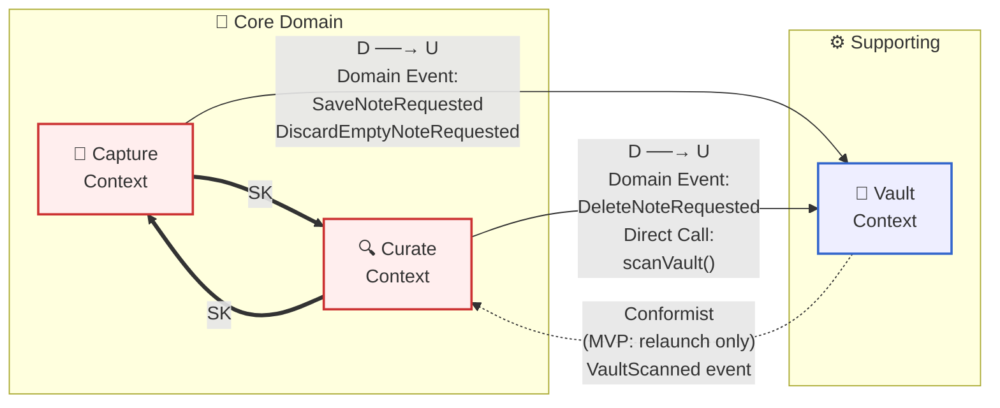

# Context Map

## 前提

本アプリは **単一プロセスのデスクトップアプリ**（MVP 想定）。Bounded Context は同一プロセス内のモジュール境界として実装されるが、DDD の境界を明示しておくことで、将来のプラグイン化・マルチプロセス化・クラウド同期にも耐える構造を確保する。

統合方式の選択：
- **In-process Domain Event（イベントバス）** を主軸にする → 結合度を最小化
- **直接呼び出し** は同期完結が必要な処理（vault スキャン結果の取得等）に限定
- **Shared Kernel** は型定義レベルで共有（`Note` の id/body/frontmatter 構造）

## Context Map 図



凡例:
- `==SK==>` Shared Kernel（型・同一性を共有）
- `D → U` Customer (Downstream) が Supplier (Upstream) を呼ぶ
- 太線 = 同期、点線 = 非同期 / 遅延伝達

## 関係一覧

| # | Upstream | Downstream | 関係 | 統合方式 | ACL | 備考 |
|---|----------|-----------|------|---------|-----|------|
| 1 | Vault | Capture | Customer-Supplier | Domain Event (in-process) | あり（Vault 側） | 保存依頼 |
| 2 | Vault | Curate | Customer-Supplier | Domain Event + Direct Call | あり（Curate 側） | 読み込み・削除依頼 |
| 3 | — | — | Shared Kernel | 型定義の共有 | — | Capture ⇔ Curate で `Note` 同一性 |
| 4 | Vault | Curate | Conformist | 起動時 pull (rescan) | — | 外部変更は再起動時のみ反映（MVP） |

## 統合の詳細

### 1. Capture → Vault（Customer-Supplier）

- **流れる Domain Event**:
  - `SaveNoteRequested { noteId, body, frontmatter }` ← `NoteAutoSavedAfterIdle` / `NoteAutoSavedOnBlur` を契機に Capture が発行
  - `DiscardEmptyNoteRequested { noteId }` ← `EmptyNoteDiscarded` イベントから派生（空のままの新規ノートはファイル化しないので、実装上はファイル不在を維持するのみで、Vault への通知は不要なことも多い）
- **統合方式**: 同一プロセスのイベントバス（例：シンプルな EventEmitter）
- **ACL の有無**: あり。Vault は Capture の `Note` Aggregate を直接 import せず、保存リクエスト DTO（`SaveNoteCommand`）に翻訳する。これにより Capture の内部表現変更が Vault の責務に波及しないようにする。
- **エラーパス**:
  - Vault 書き込み失敗 → `AutoSaveFailed` イベントを Capture に通知 → UI で警告表示
  - リトライ責務は Capture 側（編集状態を保持しているため）

### 2. Curate → Vault（Customer-Supplier）

- **流れる Domain Event / Call**:
  - 起動時：Curate は Vault に対して `scanVault(): NoteFileSnapshot[]` を **同期呼び出し**（最初のフィード構築は同期完結が UX 上自然）
  - 削除時：`DeleteNoteRequested { noteId }` を Curate が発行 → Vault が物理削除（OS ゴミ箱送り）→ `NoteDeleted` イベントで結果を Curate に通知
  - **タグチップ操作等の編集セッション外メタデータ更新**：`SaveNoteRequested` を Curate が発行（Capture と同一の Event を共有）。エディタを開かずに行う軽量更新で、debounce 不要・即時保存
  - 編集セッション内の本文/frontmatter 編集による保存は **Capture → Vault** 側に属し、Curate は関与しない
- **統合方式**: 起動時は同期 Direct Call、運用中は Domain Event
- **ACL の有無**: あり。Curate 側に「`NoteFileSnapshot` → `Note` Aggregate」変換層を置く。Markdown ファイル表現と Curate のドメインモデルを分離。
- **エラーパス**:
  - 削除失敗 → `NoteDeletionFailed` を Curate に通知 → UI で警告
  - スキャン失敗（vault 未設定など）→ `VaultDirectoryNotConfigured` イベント → Curate は空フィードで継続、設定誘導 UI

### 3. Capture ↔ Curate（Shared Kernel）

- **共有する型定義**:
  ```ts
  type NoteId = string;        // ISO timestamp + suffix（衝突回避は Phase 5 で確定）
  type Body = string;          // Markdown 本文
  type Frontmatter = {
    tags: string[];
    createdAt: string;
    updatedAt: string;
    // MVP は固定スキーマ
  };
  type Note = { id: NoteId; body: Body; frontmatter: Frontmatter };
  ```
- **理由**: 同一画面でユーザーがフォーカスを Capture（新規ノート）→ Curate（過去ノート）→ Capture（新規ノート）と切り替えるとき、`Note` の id・本文構造が一致していないと UX が破綻する。
- **管理ルール**: Shared Kernel は変更コストが高いため、変更は両 Context の合意で行う。MVP では同一開発者が両 Context を担当するため軽量に運用、将来チーム分割時は変更レビューを義務化。
- **共有しないもの**:
  - 編集中状態（`isDirty`, `idleTimerToken` など）は Capture 専用
  - フィード上の選択状態・フィルタ条件は Curate 専用
  - 表示用派生値（タグの使用回数など）は Curate 専用

### 4. Vault → Curate（Conformist, MVP のみ）

- **状況**: Obsidian 等の外部ツールが vault 内 Markdown を編集しても、Vault Context は能動的に検知しない。
- **MVP 戦略**: 「再起動時 rescan」のみ。次回起動時に `VaultScanned` イベントが発行され、Curate が Feed と TagInventory を再構築する。
- **将来の進化パス**:
  - **Phase 2**: fs watch を Vault Context が抱え、`ExternalFileChanged` イベントを発行（Open Host Service 化）。Curate が購読して差分反映。
  - **Phase 3**: 同時編集の競合解決（最終更新タイムスタンプ比較、ユーザー選択ダイアログ等）

## 統合方式の決定根拠

| 候補 | 採用 | 理由 |
|------|------|------|
| RPC / REST | ❌ | 単一プロセスでは過剰 |
| 直接関数呼び出しのみ | △ | 単純だが Context 間結合が密になり、将来分離が困難 |
| In-process Domain Event | ✅ | 結合度最小・テスト容易・将来の非同期化に直接マッピング可能 |
| Shared Kernel 型 | ✅（限定的） | `Note` 同一性のみ。乱用は禁物 |

## 未解決の問い

- **Domain Event の実装ライブラリ選定**（自前 EventEmitter / mitt / RxJS など）→ Phase 9 (workflows) または実装フェーズで決定
- **Capture と Curate を跨ぐ「ノートのフォーカス」状態管理** → 単一の UI Context（フロントエンド）が両者を仲介する形になる。これはアプリケーション層の責務として整理する。
- **Vault が複数になる将来**（Obsidian は複数 vault に対応）→ MVP では単一だが、Vault Aggregate を `VaultRegistry` で束ねる拡張点を残しておく
- **Capture の "Empty Note" は Vault に届く前に消える** → 厳密にはファイルが一度も作られないため、Vault Context は空ノートの存在自体を知らない。これは Capture 内のローカル状態として完結し、`DiscardEmptyNoteRequested` イベントは UI 状態のクリーンアップのみで使う（Vault への通知不要）。
- **TagInventory の更新は Curate 内部で完結** → Note 編集／削除の Domain Event を Curate 内で TagInventory が購読する。Vault 経由しない。
